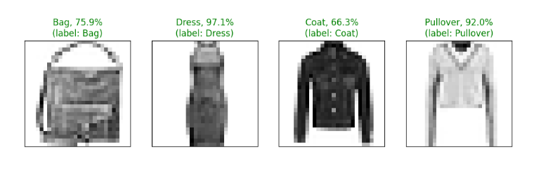

# Clothing Recognition With PyTorch Vision

Screenshot from the tensorboard results:

## Description
This project is an implementation of the MNIST dataset using the Fashion-MNIST dataset and PyTorch Vision. The MNIST dataset is a popular benchmark dataset in the field of machine learning, consisting of grayscale images of handwritten digits from 0 to 9. However, instead of using the traditional MNIST dataset, this project utilizes the Fashion-MNIST dataset, which contains grayscale images of fashion items such as shoes, shirts, dresses, and more.

The purpose of this project is to learn and understand how to train a deep learning model to classify images using the Fashion-MNIST dataset. It leverages the PyTorch Vision library, which provides various tools computer vision and machine learning training tasks.

## Features
- Loads the Fashion-MNIST dataset using PyTorch Vision.
- Preprocesses the dataset by normalizing the pixel values and splitting it into training and testing sets.
- Defines a convolutional neural network (CNN) architecture using PyTorch.
- Trains the CNN model on the training set using the stochastic gradient descent (SGD) optimizer.
- Evaluates the trained model on the testing set and calculates the accuracy.
- Saves and loads the trained model for future use.

## Requirements
- Python 3.x
- PyTorch
- TorchVision

## License
This project is licensed under the MIT License. See the [LICENSE](LICENSE) file for details.

## TODO
- Prettify repo
- Rework documentation
- Add how2install guide
